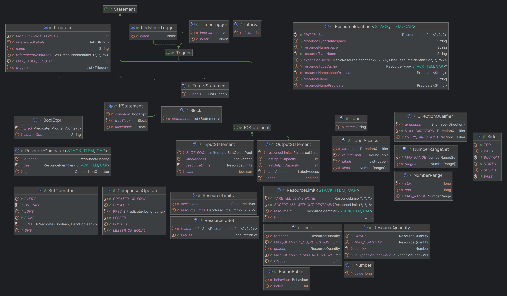

<!--suppress HtmlDeprecatedAttribute -->
<div align="center">

# Super Factory Manager 4

[](https://www.curseforge.com/minecraft/mc-mods/super-factory-manager) [](https://discord.gg/5mbUY3mu6m)


Check out [the examples folder](./examples) for sample scripts.

There are also [in-game examples](src/main/resources/assets/sfm/template_programs).

</div>

## About

Super Factory Manager is a mod for Minecraft that lets users create programs to run their factories. The mod provides a domain specific language tailored for moving items, fluids, and other resource types. A text editor is included, along with example programs.

To get started, you will need a factory manager, a label gun, and a disk.

## Mod Spotlight

[](https://www.youtube.com/watch?v=W5wY23VxZAc)

## VSCode Extension

Get the [VSCode extension](https://marketplace.visualstudio.com/items?itemName=TeamDman.super-factory-manager-language)
for syntax highlighting 🌈


## UML Diagram



## Release process

The following process is designed to catch the most obvious problems that may arise from creating a new release.

```pwsh
.\act.ps1
Manual: Bump `mod_version` in gradle.properties
Manual: Commit bump
Action: Propagate changes
Action: Run gameTestServer for all versions
Action: runData for all versions
Action: Build
Action: Wipe jars summary dir
Action: Collect jars
Action: Update PrismMC test instances to use latest build output
Action: Update test servers to latest build output
Action: Launch PrismMC
Action: Launch test server

for each version:
    Launch version from PrismMC
    Multiplayer -> join localhost
    Break previous setup
    Build new setup from scratch -- ensure core gameplay loop is always tested
    Validate changelog accuracy
    /stop
    Quit game

Action: Tag
Action: Push all

For each version:
    CurseForge -> Upload file
"https://authors.curseforge.com/#/projects/306935/files/create"
    Environment=Server+Client
    Modloader=match mc version {
        ..1.20   -> Forge
        1.20.1   -> Forge+NeoForge
        1.20.2.. -> NeoForge
    }
    Java=match mc version {
        ..1.20.4 -> Java 17
        1.21.. -> Java 21
    }
    Minecraft=$version
    Changelog= <<
        ```
        $section from changelog.sfml
        ```
    >>

For each version:
    Modrinth -> Versions -> Drag n drop
"https://modrinth.com/mod/super-factory-manager/versions"
    Adjust populated version numbers
    Changelog=same as above


GitHub -> Draft a new release
"https://github.com/TeamDman/SuperFactoryManager/releases/new"
Choose a tag=latest
Target=latest
Release title=mod version
Description= <<
    ```
        $section from changelog.sfml
    ```
>>
Attach=latest jar for each mc version
```

## Optimization

There's some neat tricks used to improve the performance of the mod, here's an overview :D

### Minimum Tick Rate

The minimum timer interval of 1 second makes crappy programs 20x more performant since they aren't running every
tick.

### Pattern Caching


Be not afraid, regular expressions are only used when necessary.


---

Using the `EACH` keyword to count by type rather than by matcher also employs a cache.

```sfm
EVERY 20 TICKS DO
    INPUT 2 EACH *ingot* FROM a
    OUTPUT TO b
END
```

This program will internally enumerate the registry to create a separate tracker for each resource type.


### Object Pooling

```sfm
EVERY 20 TICKS DO
    INPUT FROM a
    OUTPUT TO b
END
```

When many inventories are involved, this can quickly result in a lot of objects being created when the program runs.


My testing shows that object pooling provides a slight increase in performance, even if there's only tens of thousands
of objects involved.

### Testing

I created a custom barrel block used only for testing. Running all the game tests for the mod creates 2,866 barrel
blocks.
Many of those barrels are so full of items that when I clear or restart the tests it causes 27,310 stacks to be dropped
on the ground.

By creating a custom barrel that doesn't drop the inventory contents, the friction of doing more tests is reduced!


### User Empowerment

```sfm
NAME "first"
EVERY 20 TICKS DO
    INPUT FROM a
    OUTPUT TO b
END
```

```sfm
NAME "second"
EVERY 20 TICKS DO
    INPUT stone, iron_ingot FROM a
    OUTPUT TO b
END
```

Which program is more efficient? idk. Use the performance graph and compare.


Cool. Looks like the first one is twice as fast. Maybe you need to filter items though? Maybe the outcome is different
if depending on the inventories?

Rather than trying to prescribe a best approach based on how I know the mod works, it's better to directly give the
players the tools needed to perform experiments to find out what works best in their scenario.
