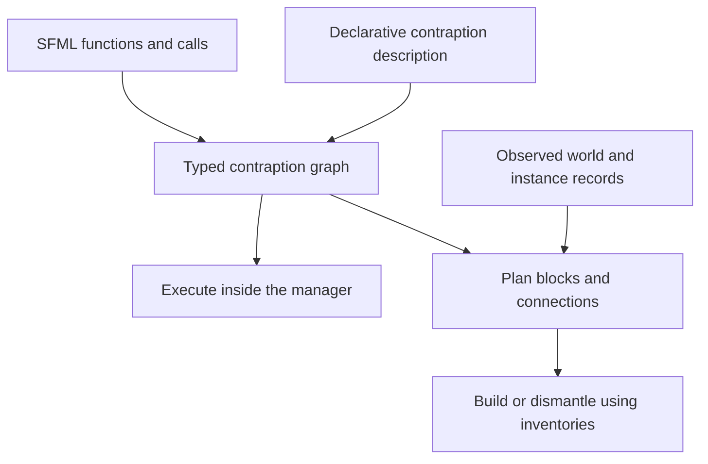

# Contraptions as code: SFM exploration

Status: contraption design exploration, with labeled redstone reads implemented
and tested on 1.19.2 (32/32 selected GameTests passed). See the
[redstone implementation plan](tasks/labeled%20redstone%20queries%20plan.md)
for the contract, validation evidence, and rerun command.

The [buffer counter implementation](tasks/buffer%20redstone%20counter%20plan.md)
adds exact stored `redstone::` counts, transfers between buffers, redstone NBT
persistence, and comparator output capped at 15. All 61 selected GameTests passed
(29 buffer cases, 29 world-query cases, and 3 existing regressions).
The buffer remains experimental; its counter example uses command-placed buffers
and a donor seeded with units. World signals remain read-only.

Base: local `1.19.2` commit `8794d96fd0f74306d70131c9b4a858db74984a89`.
Branch: `feat/1.19.2/contraption-as-code`.

For the complete redstone checkpoint and GitHub issue/discussion map, see [Redstone support in SFM](redstone-support.md).

## Idea

An SFM function could describe a reusable item-producing mechanism. Instantiating
it could expose inventories and signals that other SFML statements can use. The
same mechanism could execute inside a manager or be materialized as blocks,
inventories, cables, and redstone in the world.

Assume for this exploration that managers can support both:

- explicit item creation, as proposed, and
- building and dismantling: consuming inventory blocks to place them in the
  world, and collecting world blocks into inventories.

The Terraform analogy suggests a desired contraption, a record connecting its
logical parts to world positions, and a plan of changes needed to reach that
state. Terraform's own model uses declarative resources, dependencies, state,
and a write/plan/apply workflow. See [HashiCorp's introduction](https://developer.hashicorp.com/terraform/intro).

## The central semantic decision

The motivating sketch is speculative syntax:

```text
def a():
  4

every ticks do
  let x = new a
  input from x
  output to b
end
```

`4` needs a type: a number, four items of a specified kind, or a resource amount.
`new a` needs a lifetime: a fresh invocation, a persistent instance, or a fresh
physical structure. Allocating a structure each tick and reusing an existing
structure produce different worlds. A compiler must preserve that distinction.

A useful initial model to explore is a persistent module instance with typed
input/output ports, plus scheduled operations on it. A port is a named resource
endpoint, such as an item inventory or a readable signal. Construction establishes
the ports; each scheduled invocation performs the production operation. This is
a proposal, not a decision to make ordinary function calls stateful.

For a concrete example, choose four stone items as the result. An explicit
creative source could produce that batch into a bounded output inventory, then
SFM could transfer it to `b`. A survival implementation would need an actual
stone-producing recipe or contraption and its inputs. A physical implementation
that uses a manager as its source is different from one restricted to vanilla
blocks. The target must declare which components it can supply.

## A possible common representation



The graph would contain instance identities, resource ports, connections,
operations, schedules, and explicit state. Physical realization would add a
layout, orientation, material requirements, and mappings to labeled positions.
Infrastructure reconciliation and repeated production are separate operations:
applying the same build twice should not allocate another chest, while running
a producer twice may intentionally produce two batches.

Translation is credible for a defined subset with specified timing, capacity,
ordering, and side effects. Function calls alone do not establish equivalence
between arbitrary programs and physical machines. A compiler can preserve
tick behavior only when the target supports it; otherwise it must expose the
different timing contract or reject the translation. Likewise, reconstructing
source from arbitrary world blocks requires more than knowing block positions:
retained instance/port metadata can make round trips practical for managed
contraptions, while arbitrary builds need a separate recognition problem solved.

## What exists in this worktree

Paths below are relative to the repository. The linked redstone plan distinguishes
runtime-verified behavior from the remaining contraption design work.

| Area | Current evidence | Consequence |
| --- | --- | --- |
| Functions | [SFML.g4](../platform/minecraft/src/main/antlr/sfml/SFML.g4) permits triggers containing input, output, if, and forget statements; no function definitions or calls. | Function values, scope, ports, and lifetime are new language work. |
| Manager redstone | [BoolRedstone.java](../platform/minecraft/src/main/java/ca/teamdman/sfml/ast/BoolRedstone.java) calls `getBestNeighborSignal` at the manager. | Existing `IF REDSTONE > 0` is manager-local. |
| Labeled resource queries | The grammar already accepts `label HAS comparison amount resource`; [BoolHas.java](../platform/minecraft/src/main/java/ca/teamdman/sfml/ast/BoolHas.java) queries resource capabilities at labeled positions. | `IF abc HAS GT 0 redstone:: THEN` now controls scheduled item routing in the passing runtime suite. |
| Redstone resource | [SFMResourceTypes.java](../platform/minecraft/src/main/java/ca/teamdman/sfm/common/registry/registration/SFMResourceTypes.java) registers `redstone`; [RedstoneResourceType.java](../platform/minecraft/src/main/java/ca/teamdman/sfm/common/resourcetype/RedstoneResourceType.java) supports queries and delegates IO to writable storage. | Buffers transfer stored units; world signals remain read-only. |
| Signal provider | [RedstoneSignalCapabilityProvider.java](../platform/minecraft/src/main/java/ca/teamdman/sfm/common/capability/RedstoneSignalCapabilityProvider.java) now returns a live read-only view, with strongest-face defaults and physical-face selection. [SFMBlockCapabilityDiscovery.java](../platform/minecraft/src/main/java/ca/teamdman/sfm/common/capability/SFMBlockCapabilityDiscovery.java) recognizes actual signal sources for label cleanup/cable connections without treating air as an inventory. | Signal changes, cached reads, faces, and source labeling are tested. Chunk unload/reload and tunnel forwarding remain follow-ups. |
| Buffer | [SFMBlocks.java](../platform/minecraft/src/main/java/ca/teamdman/sfm/common/registry/registration/SFMBlocks.java) and [SFMBlockEntities.java](../platform/minecraft/src/main/java/ca/teamdman/sfm/common/registry/registration/SFMBlockEntities.java) register the buffer; [SFMItems.java](../platform/minecraft/src/main/java/ca/teamdman/sfm/common/registry/registration/SFMItems.java) registers its item only when `isInIDE()` is true. | The production restriction is more specific than the entire block being disabled. Releasing it requires an explicit feature decision. |
| Inventory IO | [InputStatement.java](../platform/minecraft/src/main/java/ca/teamdman/sfml/ast/InputStatement.java) adds an input to the program context; [ItemResourceType.java](../platform/minecraft/src/main/java/ca/teamdman/sfm/common/resourcetype/ItemResourceType.java) uses item-handler operations. | Reuse SFM's resource/slot contracts for virtual ports and builder inventories; preserve lazy input and output behavior. |

Redstone signal and redstone-block material should have distinct contracts.
Reading a signal should not consume the source. A redstone block could supply
a constant signal of 15. Emitting a chosen signal needs a writable emitter or
an explicit placement action. Consuming a redstone-block item to place that
block is an item/world operation. An arbitrary powered block is not automatically
a writable signal sink.

## Related GitHub issues

All listed issues were open when inspected during this setup.

- [#146: Functions](https://github.com/TeamDman/SuperFactoryManager/issues/146): reusable statements and restrictions on nested calls.
- [#363: Built-in functions and operators](https://github.com/TeamDman/SuperFactoryManager/issues/363): count queries and arithmetic for resource distribution.
- [#108: Redstone querying](https://github.com/TeamDman/SuperFactoryManager/issues/108) and [#229: Redstone querying/output](https://github.com/TeamDman/SuperFactoryManager/issues/229): signal access beyond the manager.
- [#591: Redstone resource game tests](https://github.com/TeamDman/SuperFactoryManager/issues/591): explicitly proposes testing `someBlock HAS = 15 redstone::` across signal strengths.
- [#465: Tunnelled manager redstone queries](https://github.com/TeamDman/SuperFactoryManager/issues/465): another endpoint-semantics case to inspect.
- [#583: Buffer loot-table startup error](https://github.com/TeamDman/SuperFactoryManager/issues/583), with related reports [#530](https://github.com/TeamDman/SuperFactoryManager/issues/530) and [#568](https://github.com/TeamDman/SuperFactoryManager/issues/568): the shipped loot table refers to an unavailable production item. An existing local branch, `agent/fix-583-buffer-loot-table-1.19.2`, is already dedicated to this fix; inspect it before duplicating that work.
- [#436: Resource groups as a transaction](https://github.com/TeamDman/SuperFactoryManager/issues/436): relevant to reserving complete recipe inputs or a set of building materials.

## First experiments to consider

1. Labeled redstone reads are now implemented for emitted signals, with passing
   tests for strengths 0 through 15, changes across ticks, explicit and omitted
   sides, multiple labels, and sources with/without block entities. Continue
   with chunk unload/reload and tunnel forwarding. A default query reads the
   strongest emitted face; existing set/side aggregation remains in effect.
2. Define one persistent producer with a bounded output port. Specify the result
   type, repeated-call behavior, full-output behavior, and restart persistence.
3. Represent that producer and a destination inventory in the common graph.
   Compare virtual execution and a small physical realization under the same
   explicitly stated observable contract.
4. Plan and build a tiny structure from materials. Reapplying should make no
   extra placements. Test missing materials, occupied positions, partial failure,
   interruption, and a full collection inventory during dismantling. Reserve
   capacity and record completed operations to prevent loss or duplication;
   arbitrary modded placement/break effects may not be reversible.
5. Define ownership and lifecycle: how instances survive edits and reloads, how
   externally changed blocks are handled, and how an instance is removed. Decide
   whether recovery is requested by the player or runs automatically.

The redstone follow-up passed 32/32 selected GameTests in an integrated client,
including normal manager-redstone and item-transfer regressions. The original
base has an unrelated dedicated-server startup failure, recorded in the linked
plan. Contraption construction, function calls, and arbitrary world-signal writes
remain design work. Buffer counters are the next implemented slice above.
Use `sfm-propagate-changes` rather than Gradle for testing.
